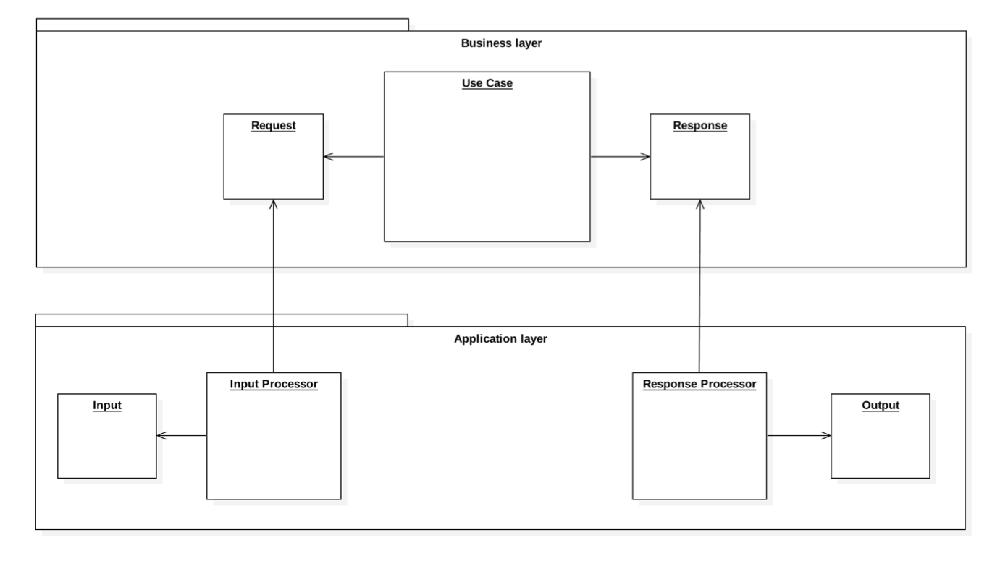

# Use Case Executor

Use Case Executor is a library that facilitates a certain way of implementation of [Screaming Architecture](https://8thlight.com/blog/uncle-bob/2011/09/30/Screaming-Architecture.html).
From the point of view of this library, every Use Case of your system is implemented in its own class, with a single
public method: `execute()`. Any data that the Use Case requires to be executed is passed to the `execute()` method
in a form of a Use Case Request object, which is a simple data structure, preferably a class with all its fields public.
Any data that needs to be presented to the Actor (the outside-world executor of the Use Case) is returned in a form
of a Use Case Response.

Use Case Requests and Responses belong to the business logic layer. They must know nothing about the way in
which the application receives its data (the application's Input), and the way in which the application presents the
data (the application's Output). This means that the Input must be processed, so that the data required by the Request
are retrieved from it and put into the proper Request object. Similarly, the Response that the Use Case returns must 
be processed, so that a proper Output that contains information interesting to the Actor is created and returned.
Use Case Executor uses Input Processors and Response Processors to perform these operations.

Once a separation like described above has been achieved, the dependencies between the application layer and the 
business logic layer present themselves like this:



Installation
============

Just run 

    $ composer require bamiz/use-case-executor

Basic usage
===========

Create a class that represents a Use Case of your system. Implement its behavior in `execute()` method. 
Pass all the required input data as an object, preferably named like your Use Case plus the word `Request`.


```php
namespace YourOrganization\YourApplication;

class MyUseCase
{
    public function execute(MyUseCaseRequest $request)
    {
        // ...
    }
}
```

In the bootstrap section of your application you will need to set up the dependencies of Use Case Executor.
Set up Input Processor Container and Response Processor container by adding the default Processors to them.

```php
$inputProcessorContainer = new \Bamiz\UseCaseExecutor\Container\Container();
$inputProcessorContainer->set(
    \Bamiz\UseCaseExecutor\Execution\UseCaseContextResolver::DEFAULT_INPUT_PROCESSOR, 
    new \Bamiz\UseCaseExecutor\Processor\Input\ArrayInputProcessor()
);

$responseProcessorContainer = new \Bamiz\UseCaseExecutor\Container\Container();
$responseProcessorContainer->set(
    \Bamiz\UseCaseExecutor\Execution\UseCaseContextResolver::DEFAULT_RESPONSE_PROCESSOR,
    new \Bamiz\UseCaseExecutor\Processor\Response\IdentityResponseProcessor()
);
```

Create a Container for your Use Cases and add your Use Case to it. Set up the Context Resolver with all the containers. 

```php
$useCaseContainer = new \Bamiz\UseCaseExecutor\Container\Container();
$useCaseContainer->set('my_use_case', new MyUseCase());

$contextResolver = new \Bamiz\UseCaseExecutor\Execution\UseCaseContextResolver(
    $useCaseContainer,
    $inputProcessorContainer,
    $responseProcessorContainer
);
```

Add the configuration of the Use Case to the Context Resolver. The minimum configuration contains the Use Case name
and its Request class name.

```php
$contextResolver->addUseCaseConfiguration(['use_case' => 'my_use_case', 'request_class' => MyUseCaseRequest::class]);
```

Create a Use Case Executor:

```php
$actorRecognizer = new \Bamiz\UseCaseExecutor\Actor\CompositeActorRecognizer();
$useCaseExecutor = new \Bamiz\UseCaseExecutor\UseCaseExecutor($contextResolver, $actorRecognizer); 
```

Use the Executor to execute your Use Cases. Leave the details of processing the Input and creating the Output to the 
Input and Response processors:

```php
$output = $useCaseExecutor->execute('my_use_case', $input);
```

See also
========

* [Screaming Architecture blog post on Robert C. Martin's blog](https://8thlight.com/blog/uncle-bob/2011/09/30/Screaming-Architecture.html)
- a blog post published on September 30, 2011, explaining the concept of Screaming Architecture in detail
* [Use Case Executor Bundle](https://github.com/bartosz-zasada/use-case-executor-bundle) - a Symfony bundle providing
configuration and several Processors that make the Executor much easier to use with Symfony
* [Screaming Webshop](https://github.com/bartosz-zasada/screaming-webshop) - an example of Screaming Architecture
implementation, with and without using Use Case Executor Bundle
* [Slides from my presentation about Screaming Architecture](https://speakerdeck.com/bamizpl/screaming-architecture)
